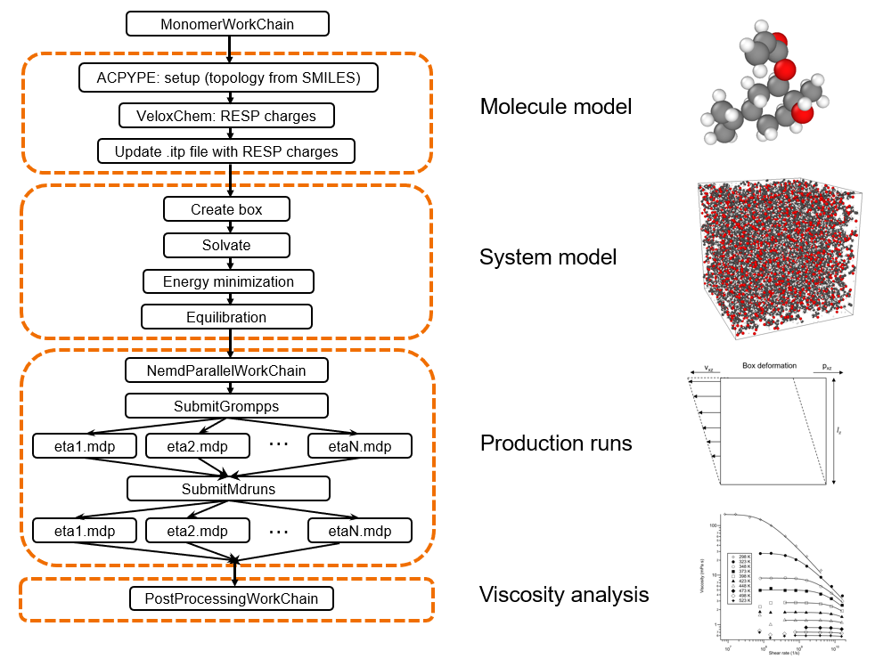

# AiiDA Workchain for Viscosity

[AiiDA](https://aiida.readthedocs.io/projects/aiida-core/en/stable/) workflow for automated calculation of shear viscosity of a molecular liquid

## Features

- Generation of Gromacs molecular topology using [ACPYPE](https://github.com/alanwilter/acpype?tab=readme-ov-file) and GAFF force field from SMILES string
- RESP partial charge calculation using [Veloxchem](https://veloxchem.org/docs/intro.html)
- Parallel shear viscosity calculation for several shear rates using [Gromacs](https://www.gromacs.org/)
- Output: Newtonian shear viscosity



## Installation

```bash
cd <PATH to folder with pyproject.toml>
pip install .[plotting,tui]
```

The extra dependencies are optional and used for:

- `plotting`: for plotting the results of the viscosity calculation.
- `tui`: for adding an `aitw-viscosity tui` subcommand launching a text user interface (TUI) to help setting up the workchain inputs.

## Usage

The package provides the following AiiDA entry point that can be used to load the workchains

### Main workchain

Workchains performing the full calculations advertised by the package.

- `aitw.gromacs.viscosity`: Compute the viscosity of a molecule starting from the SMILES string (uses al the previou).

### Sub-workchains

Workchains performing smaller parts of the full calculation that can also be used independently.

- `aitw.veloxchem.resp_charges`: Generate GROMACS input files with RESP charges computed using Veloxchem starting from a SMILES string.
- `aitw.gromacs.equilibration`: Equilibrate a box of molecules using GROMACS starting.
- `aitw.gromacs.nemd`: Perform Non-Equilibrium Molecular Dynamics (NEMD) simulations using GROMACS.

### CLI

The tool makes available 2 main cli commands grouped following the normal aiida CLI style.

- `aitw-viscosity workflow launch viscosity`: Launch the viscosity workchain from the command line.
- `aitw-viscosity data plot-viscosity`: Plot the results of a completed viscosity workchain.

For both commands you can use the `-h` / `--help` flag to get more information about the available options.

example

```bash

aitw-viscosity workflow launch viscosity \
    --acpype <ACPYPE CODE IDENTIFIER> \
    --gromacs <GROMACS CODE IDENTIFIER> \
    --veloxchem <VELOXCHEM CODE IDENTIFIER> \
    --obabel <OPENBABEL CODE IDENTIFIER> \
    --smiles-string 'CC(=C)C(=O)OC1C[C@H]2CC[C@]1(C)C2(C)C' \
    --num-molecules 100 \
    --num-steps 5000000 \
    --temperature 343
```

Replace the `<CODE IDENTIFIER>` with the actual code identifiers (PK or label) of the installed codes in your AiiDA database. \
Adjust the other parameters as needed.

OUTPUT:

``` bash
# ...
# REPORT
# ...
# Output link               Node pk and type
# ------------------------------------------------------------
# acpype__gro               SinglefileData<9308>
# acpype__itp               SinglefileData<9311>
# acpype__pdb               SinglefileData<9317>
# acpype__top               SinglefileData<9314>
# equilibrated_box_length_nm Float<9381>
# equilibrated_gro          SinglefileData<9378>
# eta_N                     Float<9563>
# nemd__edr_0_002           SinglefileData<9451>
# nemd__edr_0_005           SinglefileData<9444>
# nemd__edr_0_01            SinglefileData<9472>
# nemd__edr_0_02            SinglefileData<9465>
# nemd__edr_0_05            SinglefileData<9458>
# nemd__edr_0_1             SinglefileData<9479>
# nemd__edr_0_2             SinglefileData<9486>
# sigma_E                   Float<9564>
# system_gro                SinglefileData<9344>
# viscosity_data            ArrayData<9561>
# xyz                       SinglefileData<9323>
```

Plotting the results

```bash
aitw-viscosity data plot-viscosity 9561 --show-plot
```

Replace the PK of the viscosity `ArrayData` with the actual PK from your run.\
Use `--help` to see all the available options.

**NOTE**: Not all possible inputs to the workchain are exposed through the CLI. For more advanced usage, consider running the workchain programmatically.

### Programmatically

See the [CLI file](aitw_aiida_viscosity/cli/workflows/viscosity.py) for an example of how to run the workchain programmatically.

EG: The same code in the function `launch_workflow` could be adjusted and used in a python script to automate launching the workflow for multiple molecules/parameters at once.
Using the daemon (requires AiiDA to be configured with RabbitMQ and a database) is required to run all the submitted workchains in parallel.

### Tips

When running the `MonomerWorkChain` on a remote computer (e.g. an HPC cluster) it is suggested to also install some of the required codes locally on the machine to speed up the calculation and avoid submitting many serial jobs to the cluster.
In particular the following are always run serially:
- ACPYPE
- OpenBabel
- Veloxchem

GROMACS will also run several initialization calculations that only requires one core.
For this reason the workchain allows as an input 2 different GROMACS codes:
- `gmx_code`: used for parallel runs
- `gmx_code_local`: used for single core runs

Using a local GROMACS installation for `gmx_code_local` will also improve the speed of the workchains.
This can also be provided through the CLI with the `--gromacs-local` option.

### Tab autocompletion

Enabling tab autocompletion https://click.palletsprojects.com/en/stable/shell-completion/

E.G for `bash` run the command

```bash
eval "$(_AITW_VISCOSITY_COMPLETE=bash_source aitw-viscosity)"
```

You can also add it to either `~/.bashrc` or, if you are using a virtual environment, to `bin/activate` of the virtual environment to avoid running the command for every new shell.
